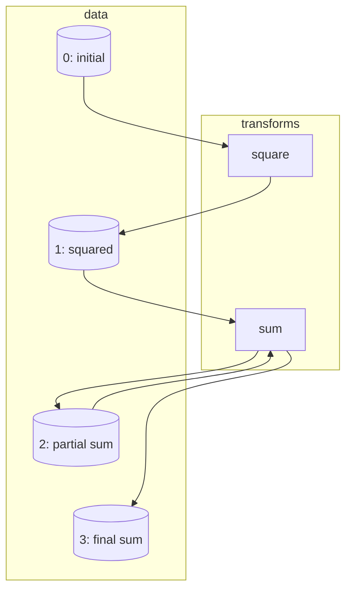
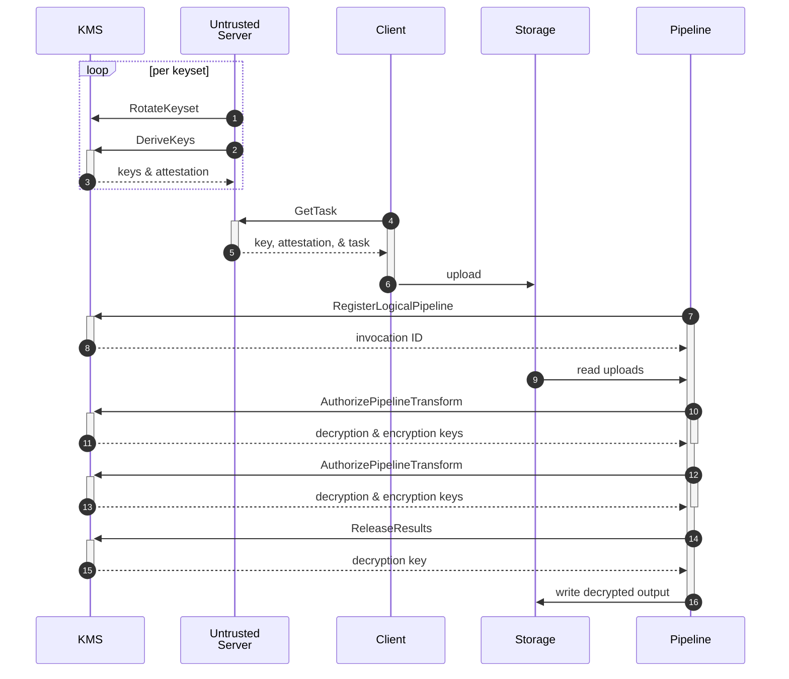

# CFC KMS

The Confidential Federated Compute Key Management Service (CFC KMS) manages keys
for encrypting private data and processing that data using publicly verifiable
pipelines. Conceptually, the KMS combines a *key store* (for holding keys needed
to decrypt uploaded data) with a small *stateful database* (for tracking which
inputs have already been processed). Combining the two services ensures that the
usage database cannot be cleared or disrupted without also affecting the
corresponding decryption keys.

Building on these capabilities, the KMS enables secure asynchronous
communication between data producers and consumers using pre-existing channels,
such as uploads with HTTP POST, transmission with Google Cloud Pub/Sub, or
processing with Apache Beam. Client devices and non-terminal processing steps
are data producers; processing steps are data consumers.

Built on [Project Oak](https://github.com/project-oak/oak) and the
[Trusted Computations Platform](https://github.com/google-parfait/trusted-computations-platform)
(TCP), the CFC KMS is publicly verifiable and fault-tolerant.

## Requirements

1.  All server components that access unencrypted client data must run in a
    [trusted execution environment](https://en.wikipedia.org/wiki/Trusted_execution_environment)
    (TEE) and be remotely attestable.
2.  Use of the uploaded data is described by a
    [data access policy](#access-policies) capturing what binaries will access
    the data and under what constraints (e.g. differential privacy parameters).
    The policy must be publicly auditable.
3.  The data access policy must be bound to the client data at upload time; it
    should not be possible to change how data can be processed *after* it has
    been uploaded.
4.  The client device to processing pipeline communication must be secure and
    asynchronous. The processing pipeline may not start running until after the
    data has been sent by the client device.
5.  Client device to processing pipeline communication must be compatible with
    standard data upload mechanisms (e.g., HTTP POST to temporary storage).
6.  The uploaded data must be subject to an N days TTL. Enforcement of this TTL
    is not verifiable, but the verifiable components should make a best-effort
    attempt to enforce the TTL.
7.  The system should scale to billions of records uploaded per day and have
    high availability.

### Non-Goals

1.  While the system must not permit client data to be accessed in unauthorized
    ways, it does not need to prevent a malicious actor from making client data
    inaccessible. For example, the system does not to protect against client
    data being deleted from temporary storage or from data loss if the majority
    of server jobs are terminated.

## Design Overview

The CFC KMS is implemented as a TEE-based key management service that issues
hybrid public key encryption (HPKE) keys for protecting both uploaded data and
short-lived intermediate files produced by processing pipelines. These pipelines
are also TEE-based, and the KMS will only share decryption keys with the
pipeline worker nodes running the specific software versions authorized by an
[*access policy*](#access-policies) selected at the time the data was uploaded.
Client devices are therefore able to know at upload time precisely in which ways
their data is permitted to be used.

Client devices require that both the access policy and KMS version have been
recorded in a public transparency log, preventing split-view attacks where
different clients are served different access policies or KMS implementations.
See [Inspecting Confidential Federated Compute endorsements from the
transparency log](/docs/inspecting_endorsements.md) for more information on this
process.

The KMS also stores rollback-protected state for each pipeline, allowing the
pipelines to track privacy budgets. These budgets often have very concise
representations that do not scale with the number of uploads (e.g. "all data
before 2025-01-01 has no remaining budget"); in cases where the budget-tracking
state is large, pipelines can instead store a cryptographic checksum. State
updates use optimistic concurrency: pipelines are allowed to run and produce
encrypted outputs without updating the state, but the pipelines can make a state
mutation a prerequisite for releasing an output outside of a TEE. Note that the
KMS guarantees integrity but not secrecy for the persisted state.

Encryption keys and pipeline state are stored in the same replicated key-value
database that is kept in-memory in TEEs and replicated using
[RAFT](https://raft.github.io). Any attempt to clear stored pipeline state by
restarting the RAFT cluster would also destroy the decryption keys for uploaded
data and pipeline intermediates.

## Access Policies

An *access policy* describes what data processing pipelines can access uploaded
data, the specific binaries making up those pipelines, and any constraints
associated with that processing (e.g. differential privacy parameters). An
access policy is composed of three different layers:

*   The
    [`DataAccessPolicy`](https://github.com/google-parfait/federated-compute/blob/main/fcp/protos/confidentialcompute/access_policy.proto)
    (a.k.a. `AuthorizedLogicalPipelinePolicies`) specifies the different data
    processing pipelines that are authorized to access the data. Specifically,
    it contains one or more *logical pipeline policies*.
*   A *logical pipeline policy* describes one or more authorized *variants*
    (i.e. versions) of a pipeline. Supporting multiple versions enables access
    policy updates to be decoupled from rolling out new processing pipeline
    versions. While the logical pipeline policy can contain multiple variants,
    usually only one of those variants will actually process the uploaded data.
*   A *pipeline variant policy* describes the specific sequence of TEE-hosted
    binaries that are authorized to process the uploaded data, as well as any
    privacy configuration for those binaries (e.g. differential privacy
    parameters).

A pipeline variant policy encodes a directed bipartite graph, where one set of
nodes represents data in the system (e.g. initial uploads, encrypted
intermediates passed between pipeline steps, and the final outputs of the
pipeline) and the other set of nodes represents processing steps in the pipeline
(*transforms*) that consume zero or more inputs and produce zero or more
outputs. Each transform node specifies the *reference values* (binary hashes of
the kernel, system, and application layers) that describe the VM performing that
processing step. Any process that doesn't match these reference values will be
denied access to the keys needed to decrypt the transform's inputs.

For example, consider a simple pipeline that computes the sum of squares for its
inputs by first performing a map step that squares each input (`square`) and
then a reduce step that computes a sum (`sum`) using a hierarchical multi-step
process. The sum step may therefore produce partially aggregated results that
will be read in by another instance of the sum VM.

```protobuf
transforms {
  src_node_ids: [0]
  dst_node_ids: [1]
  application { reference_values { ... } }
  config_constraints { ... }
}
transform {
  src_nodes_ids: [1, 2]
  dst_node_ids: [2, 3]
  application { reference_values { ... } }
  config_constraints { ... }
}
```



By using different encryption keys for each data node (`0`, `1`, `2`, and `3`),
the KMS can ensure that each transform is only able to read its authorized
inputs.

The use of access policies allows a client to delegate remote attestation
responsibilities to the KMS. The client therefore only needs to attest a single
server, not a whole chain of them. This (a) reduces the number of attestations
sent to the client, saving bandwidth, and (b) allows the processing jobs to be
started *after* the client uploads data, simplifying server management. Clients
only accept data access policies with endorsements in a public transparency log,
ensuring that all access policies are auditable.

## TTLs via Crypto-Erasure

Upload encryption keys generated by the KMS have expiration times, after which
the KMS erases them from its memory, preventing further use. Encryption keys for
pipeline intermediates similarly have expiration times, and when a pipeline
requests decryption keys for its inputs from the KMS, it will not receive any
keys that expire *before* the encryption keys for its outputs. This ensures that
a well-behaved pipeline doesn't accidentally extend the lifespan of input data
beyond the intended TTL.

However, getting access to a trusted time source is difficult—especially at high
QPS. Instead, the KMS maintains a replicated, monotonically increasing record of
the observed system time; this time is used to (a) set issued at and expiration
times on new keys and (b) trigger the erasure of expired old keys.

*   If the (untrusted) system time is far in the past, the keys generated by the
    KMS will already be expired and clients will not upload data.

*   If the (untrusted) system time is far in the future, keys generated will not
    be valid yet and clients will not upload data. Moreover, the KMS will expire
    any data that was previously uploaded with a more accurate timestamp.

The system operator is therefore motivated to provide an accurate clock.

## Encryption lifecycle



1.  An untrusted server periodically calls `RotateKeyset(keyset, ttl)` to add a
    new key to `keyset` and mark it as active. The KMS stores input key material
    (IKM) used for deriving per-`DataAccessPolicy` HPKE keys. Using key
    derivation prevents the KMS's stored state from growing linearly with the
    number of `DataAccessPolicy` messages. Each key in the keyset has a TTL,
    resulting in old (and ideally non-active) keys expiring and the
    crypto-erasure of all data encrypted with those keys.

    Deriving a key per `DataAccessPolicy` instead of per `LogicalPipelinePolicy`
    ensures that clients only need to encrypt their data once while still
    allowing that data to be processed by multiple logical pipelines. This does,
    however, require the KMS to map logical pipelines back to potentially
    multiple `DataAccessPolicy` messages during `RegisterPipelineInvocation`
    calls.

2.  When a new `DataAccessPolicy` message is defined or a keyset is rotated, the
    untrusted server calls `DeriveKeys(keyset, data_access_policies)` to derive
    HPKE public keys for the specified keyset and `DataAccessPolicy` messages.
    Keys are derived only from the keyset's active key.

3.  The KMS derives one or more HPKE keys using `HKDF(keyset.active_key.ikm,
    data_access_policy)`, signs the public keys (including a claim specifying
    the `DataAccessPolicy` used), and returns them along with its TEE
    attestation evidence. This proves that the keys were produced by a KMS
    running in a TEE.

4.  When clients have data to upload, they contact the untrusted server to
    obtain upload instructions.

5.  The untrusted server returns the encryption key, KMS attestation, and an
    optional "task" describing any client-side preprocessing to perform. The
    client verifies that the encryption key is properly signed and that the
    attestation is included in a transparency log.

6.  The client encrypts and uploads its data to untrusted storage.

7.  Some time later, a processing pipeline starts and registers itself with the
    KMS by calling `RegisterPipelineInvocation(logical_pipeline_name,
    pipeline_variant_policy, keyset, intermediates_ttl)`.

8.  The KMS identifies all `DataAccessPolicy` messages including that logical
    pipeline and pipeline variant and stores them for future
    `AuthorizePipelineTransform` calls. It also creates
    pipeline-invocation-specific IKM for pipeline intermediates. The KMS returns
    an ID for this new invocation.

9.  The pipeline reads inputs from storage and passes them to a sequence of
    TEEs.

10. For each pipeline worker TEE, the pipeline calls
    `AuthorizePipelineTransform(invocation_id, tee_evidence)`.

11. The KMS finds the node in the invocation's `PipelineVariantPolicy` that
    authorizes the worker TEE. If it's authorized to read uploads, the KMS
    derives the HPKE decryption keys for each; this derivation uses *all* keys
    in the keyset that expire after `intermediates_ttl`. If it's authorized to
    read an intermediate with ID `n`, the KMS derives a HPKE decryption key from
    the pipeline IKM and the ID `n`. Encryption keys are similarly derived for
    each authorized output. These keys are returned to the worker TEE over an
    encrypted channel.

    The KMS also returns a signed statement certifying that the TEE is
    authorized to participate in this pipeline invocation.

12. When the worker TEEs for the next step of processing start, the pipeline
    similarly calls `AuthorizePipelineTransform(invocation_id, tee_evidence)`.

13. The KMS derives and returns encryption and decryption keys again. Assuming
    the access policy only authorizes the second step of the pipeline to read
    the outputs of the first, the second set of worker TEEs wouldn't receive
    decryption keys for the original device uploads.

14. When the sequence of TEEs has produced its final result, the output is
    encrypted and returned to the untrusted portion of the pipeline along with a
    *release token*. The release token contains the output's symmetric
    encryption key, encrypted using a HPKE key from the KMS and signed by the
    worker TEE. It also contains a mutation to the logical pipeline's stored
    state, represented as a required initial and desired updated state.

    The pipeline calls `ReleaseResults(release_token, worker_certificate)`.

15. After verifying that the release token was produced by a TEE that's part of
    this pipeline invocation (by checking the signed statement from 11) and
    successfully applying the mutation to the logical pipeline's stored state,
    the KMS decrypts and returns the symmetric encryption key that was in the
    release token. Note that since this is an ephemeral key, it cannot be used
    to decrypt any other data.

    If the mutation in the release token cannot be applied (e.g. due to a
    concurrent modification), the symmetric key is not returned. If the update
    can be merged with whatever concurrent modification occurred, the pipeline
    may use a TEE to generate a new release token. Otherwise, the pipeline's
    computation is wasted. Pipeline operators are therefore encouraged to avoid
    incompatible concurrent modifications.

16. The pipeline uses the returned key to decrypt the final encrypted result and
    write it to storage.

When the pipeline invocation's IKM expires, all intermediates will no longer be
accessible.

### Upload encryption: HPKE + AEAD

For compatibility with clients and pipelines that used the legacy ledger server,
data may be encrypted using a combination of hybrid public key encryption
(HPKE) and authenticated encryption with associated data (AEAD); since an AEAD
algorithm is already part of HPKE, this means that AEAD is applied twice (each
time to different data).

1.  The client data `M` is encrypted using AEAD with an ephemeral key `EK` and
    associated data `AD`. To reduce wire size by avoiding needing to transmit
    the nonce, **this encryption uses a fixed nonce**, which is safe because
    `EK` is never reused.

2.  The key `EK` is encrypted using HPKE with the KMS-provided public key `PK`
    and associated data `AD`.

This was intended to allow the ledger to decrypt and authenticate `Enc(EK, PK,
AD)` without needing access to the encrypted message, which is potentially
large. The ledger would then share `EK` with each authorized pipeline node
instead of `PK`. Since the KMS shares `PK` itself with worker TEEs, this process
no longer offers any benefit—but the migration will take some time.

Algorithms used:

*   HPKE: `DHKEM_X25519_HKDF_SHA256_HKDF_SHA256_AES_128_GCM`
*   AEAD: `AES_128_GCM_SIV`
