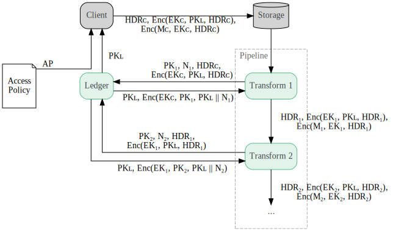
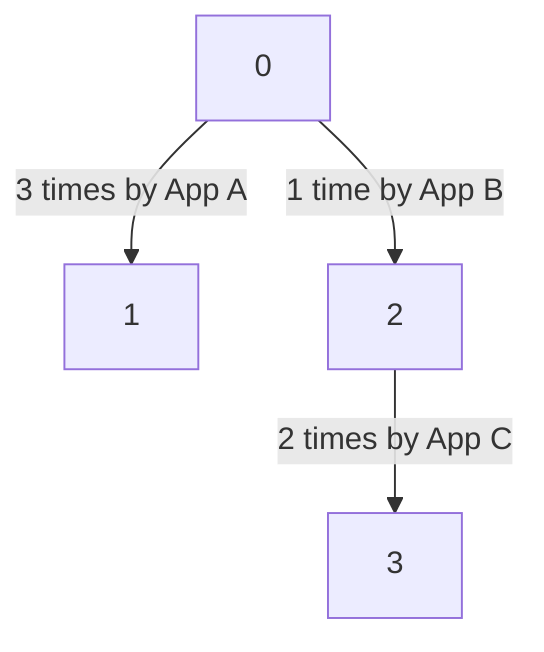

# Ledger

The ledger is the TEE-hosted application that enables client devices, after
verifying the identity of software in the TEE, to reason about the full set of
downstream uses in which any uploaded data may participate. Conceptually, the
ledger combines a *key store* (holding keys needed to decrypt any uploaded data)
with a *stateful policy engine* (that enforces that keys are given out only to
other TEE-hosted software with approved access).

In more technical terms, the ledger is a key unwrapping service that enforces
stateful use-based privacy policies, allowing secure asynchronous communication
between data producers and consumers using pre-existing channels, such as
uploads with HTTP POST, transmission with Google Cloud Pub/Sub, or processing
with Apache Beam. Client devices and non-terminal processing steps are data
producers; processing steps are data consumers.

## Requirements

1.  All server components that access unencrypted client data must run in a
    [trusted execution environment](https://en.wikipedia.org/wiki/Trusted_execution_environment)
    (TEE) and be remotely attestable.
2.  The client device to processing pipeline communication must be secure and
    asynchronous. The processing pipeline may not start running until after the
    data has been sent by the client device.
3.  Client device to processing pipeline communication must be compatible with
    standard data upload mechanisms (e.g., HTTP POST to temporary storage).
4.  The uploaded data must be subject to an N days TTL. Enforcement of this TTL
    is not verifiable, but the verifiable components should make a best-effort
    attempt to enforce the TTL. The client should be able to revoke its data
    before the TTL has been reached, preventing any future usage of that data.
    (P2) The client should be able to refresh the TTL on already-uploaded data,
    and this process must be computationally and bandwidth inexpensive.
5.  The access policy must be inspectable by the client. It must specify both
    who can access the data and how many times (e.g., as a fixed count or as a
    differential privacy budget). (P2) The client should be able to modify the
    policy to remove uses which it does not approve of anymore.
6.  The system should scale to billions of records uploaded per day.

### Non-Goals

1.  While the system must not permit client data to be accessed more times than
    allowed, it does not need to prevent a malicious actor from making client
    data inaccessible.
    *   The system does not to protect against client data being deleted from
        temporary storage.
    *   The system does not need to protect a malicious request from consuming
        the access budget. Or more accurately, this class of exploit needn't be
        handled by publicly-verifiable parts of the system.

## Design Overview

The ledger is implemented as a TEE-based key unwrapping service that uses a
consensus protocol to maintain a replicated, append-only record of the remaining
usage budget for each blob of client data. When uploading a blob, client devices
encrypt it using authenticated encryption with associated data (AEAD) with a
random key, then wrap that key using using hybrid public key encryption (HPKE)
with a public key owned by the ledger. When processing jobs want to access the
blob, they request that the ledger unwrap the AEAD key, which the ledger does
only after verifying that the processing job should have access and that there
is sufficient remaining budget. The ledger regularly rotates its HPKE key pairs
to crypto-erase uploaded client data.

NOTE: Support for replication is in development.

> **Notation:**
>
> *   $M_x$ is a message produced by $x$ that's intended to be securely sent to
>     another party.
> *   $HDR_x$ is the
>     [blob header](https://github.com/google/federated-compute/blob/main/fcp/protos/confidentialcompute/blob_header.proto)
>     for $M_x$, containing the access policy hash and other metadata.
> *   $PK_x$ is a public encryption key whose private key is held by $x$.
> *   $EK_x$ is an ephemeral encryption key generated by $x$.
> *   $Enc(M, K, AD)$ is the result of encrypting the message $M$ with the key
>     $K$ and associated data $AD$. It denotes symmetric or hybrid encryption,
>     depending on the type of the key.
> *   $x || y$ denotes the concatenation of $x$ and $y$.
> *   $N_x$ is a nonce generated by Transform $x$ to prevent replay of responses
>     from the ledger.



1.  An
    [access policy](https://github.com/google/federated-compute/blob/main/fcp/protos/confidentialcompute/access_policy.proto)
    $AP$ is shared with the client along with an attested public key $PK_L$ from
    the ledger.

    *   $AP$ and $PK_L$ may be cached by an untrusted intermediary. The client
        verifies the ledger's attestation, which includes issued at and
        expiration timestamps. See
        [TTLs via Crypto-Erasure](#ttls-via-crypto-erasure) for details on how
        these timestamps are used.

2.  The client generates an ephemeral key $EK_C$ as well as a
    [blob header](https://github.com/google/federated-compute/blob/main/fcp/protos/confidentialcompute/blob_header.proto)
    $HDR_C$ containing a unique blob id $ID$ and $SHA256(AP)$. The client
    uploads $HDR_C$, $Enc(EK_C, PK_L, HDR_C)$ (symmetric encryption key
    encrypted with ledger's public key), and $Enc(M_C, EK_C, HDR_C)$ (message
    encrypted with symmetric encryption key) to untrusted storage. (See
    [Encryption: HPKE + AEAD](#encryption-hpke--aead) for details on this double
    encryption scheme.)

3.  Later, a component in a data processing pipeline, Transform 1, reads
    $HDR_C$, $Enc(EK_C, PK_L, HDR_C)$, and $Enc(M_C, EK_C, HDR_C)$ from storage.

    *   The storage should be configured with a TTL to prevent unbounded growth,
        but TTLs are also provided on a best-effort basis via crypto-erasure.
        (See [TTLs via Crypto-Erasure](#ttls-via-crypto-erasure).)

4.  Transform 1 requests that the ledger unwrap $EK_C$ by sending its attested
    public key $PK_1$, a nonce $N_1$, $HDR_C$, $Enc(EK_C, PK_L, HDR_C)$, and the
    access policy $AP$ under which access is being requested.

5.  The ledger verifies that the access policy $AP$ matches $SHA256(AP)$ from
    $HDR_C$, that Transform 1 is authorized, and that there's budget remaining
    for $ID$. If so, it decrypts $Enc(EK_C, PK_L, HDR_C)$ and updates the
    budget. It replies to Transform 1 with $PK_L$, and $Enc(EK_C, PK_1, PK_L ||
    N_1)$ (the symmetric encryption key encrypted with Transform 1's public
    key).

    *   If the ledger hasn't seen $ID$ before, it assumes that the full budget
        is remaining. This allows data to be encrypted without involving the
        ledger.

    *   The ledger stores $PK_L$'s private key and the remaining budgets for all
        data encrypted with $PK_L$ in the same replicated record. If an attacker
        wipes out that record in an attempt to make the system forget prior data
        accesses, the system will also forget $PK_L$'s associated private key,
        preventing access to the data.

    *   By verifying that the nonce in the response matches the request and is
        only used once, Transform 1 can ensure that it's not receiving a
        replayed response, which would circumvent the ledger's budget tracking.
        Without this, a process intercepting traffic to Transform 1 could
        instruct it to process $Enc(M_C, EK_C, HDR_C)$ multiple times and use
        the same ledger response each time.

6.  Transform 1 decrypts $EK_C$ using its private key, then decrypts $M_C$ using
    $EK_C$. It transforms $M_C$ to produce $M_1$ (e.g., a model update from this
    single user's data), which it then re-encrypts using the same process as the
    client with a random key $EK_1$, producing $HDR_1$, $Enc(EK_1, PK_L,
    HDR_1)$, and $Enc(M_1, EK_1, HDR_1)$.

    *   The double encryption scheme is used again because the output is
        intended to be consumed asynchronously by Transform 2.

    *   Encrypting $M_1$ with $PK_L$ ensures that derived data is subject to the
        same TTL as the original data.

7.  Transform 2 makes a similar request to the ledger with its attested public
    key $PK_2$, a nonce $N_2$, $HDR_1$, $Enc(EK_1, PK_L, HDR_1)$, and $AP$.

8.  The ledger repeats the verification authentication and authorization process
    and returns $PK_L$ and $Enc(EK_1, PK_2, PK_L || N_2)$.

9.  Transform 2 decrypts $M_1$ using the information from the ledger, processes
    it (e.g., to produce a cross-user aggregate and differentially private
    private model update), and re-encrypts the result (like in step 6). The
    process continues with additional transforms until the final one doesn't
    encrypt its output (e.g., because it has aggregated enough values across
    users and added sufficient noise to anonymize the result to meet the
    requirements specified by the access policy).

### Other operations

*   To revoke access to client data, the client can send a request containing
    $ID$ to the ledger, asking it to set the remaining budget to 0. The ledger
    can honor this request without additional verification.

*   To refresh the TTL on client data, the client obtains a new public key from
    the ledger $PK_L'$ with a more distant expiration time. It then replaces
    $Enc(EK_C, PK_L, HDR_C)$ in the storage with $Enc(EK_C, PK_L', HDR_C)$. No
    changes to $Enc(M_c, EK_C, HDR_C)$ are needed.

## TTLs via Crypto-Erasure

Public keys generated by the ledger have an expiration time, after which (a) the
ledger refuses to decrypt any data using them and (b) the ledger will stop
maintaining the append-only record containing the key and budgets for data
encrypted with that key. However, getting access to a trusted time source is
difficult -- especially at high QPS. Instead, the ledger requires that all
requests to access data provide the current time. From this, the ledger
maintains a monotonically increasing notion of the current time, which is used
to (a) set issued at and expiration times on new keys and (b) trigger discarding
old keys. (To prevent low QPS from allowing the timestamp to becomes stale,
timestamp can additionally be provided outside of data access requests.)

*   If the times provided are far in the past, the public keys generated by the
    ledger will already be expired and clients will not upload data.

*   If the times provided are far in the future, the public keys generated will
    not be valid yet and clients will not upload data. Moreover, the ledger will
    expire any data that was previously uploaded with a more accurate timestamp.

The system operator is therefore motivated to provide a relatively accurate
time.

## Encryption: HPKE + AEAD

Blobs are encrypted using a combination of hybrid public key encryption (HPKE)
and authenticated encryption with associated data (AEAD); since an AEAD
algorithm is already part of HPKE, this means that AEAD is applied twice (each
time to different data).

1.  The client data $M_C$ is encrypted using AEAD with an ephemeral key $EK_C$
    and associated data $HDR_C$. To reduce wire size by avoiding needing to
    transmit the nonce, **this encryption uses a fixed nonce**, which should be
    safe because $EK_C$ is never reused.

2.  The key $EK_C$ is encrypted using HPKE with the ledger’s public key $PK_L$
    and associated data $HDR_C$.

This allows the ledger to decrypt and authenticate $Enc(EK_C, PK_L, HDR_C)$
without needing access to the encrypted message, which is potentially large. The
processing pipeline can then decrypt the encrypted message without needing to
consider the hybrid encryption used for $EK_C$.

To extend the TTL on previously-uploaded data, the client can re-encrypt and
upload $EK_C$ with a newer ledger public key.

Algorithms used:

*   HPKE: `DHKEM_X25519_HKDF_SHA256_HKDF_SHA256_AES_128_GCM`
*   AEAD: `AES_128_GCM_SIV`

### Alternative: Only HPKE

HPKE consists of a key encapsulation mechanism (KEM), key derivation function
(KDF), and authenticated encryption (AEAD). In theory, the client could encrypt
its data directly with HPKE ($Enc(M_C, PK_L, HDR_C)$) and decryption could be
split between the ledger (KEM) and processing job (KDF & AEAD). Note that it'd
still be necessary for the ledger's response containing the de-encapsulated key
to be sent to the transform over a secure channel (e.g. using HPKE).

Pros:

*   Client-side encryption is simpler and more standard.
*   The client payload has one fewer AEAD checksum, saving 16 bytes.

Cons:

*   Decryption cannot use high-level HPKE interfaces because it's split between
    two processes.
*   The KEM does not contain a checksum, so the ledger cannot know if
    de-encapsulation was successful. This means that it cannot know if the right
    header (including access policy) was provided; the transform would be able
    to verify the header used, but not until after the usage budget had been
    updated. Note that it'd also be necessary to ensure that the ledger and
    transform are using the same header (e.g. by having the client include
    $HDR_C$ in the HPKE info field).
*   KEMs often use Diffie-Helman to derive an encryption key; in general, it’s
    not possible for the client to re-derive the same symmetric key using a new
    ledger public key. This would prevent extending the TTL on uploaded data by
    re-uploading just the symmetric key encrypted with a newer HPKE key. (The
    client could upload the derived key encrypted with HPKE as in the design
    above, but that would result in different decryption mechanisms for initial
    and TTL-extended records.)

Several of these cons could be addressed by using a custom KEM that supports
encryption (instead of derivation) and includes a checksum, but that negates
both of the pros.

## Access Policies

An access policy imposes limits on what processes can access a data blob and how
many, as well as limits on all derived artifacts. If remote attestation is
viewed as authentication of a processing job that produces some number of
verified properties of that job (e.g., binary hash, build provenance,
endorsements), the access policy provides authorization, specifying the
properties a job must have to be granted access.

The access policy can match against a variety of properties of the application
depending on the policy author’s requirements. There's currently support for
matching against (a) binary hashes or endorsements using reference values and
(b) properties of the application's runtime configuration (e.g., $(\varepsilon,
\delta)$ for a DP aggregator). The matchable application configuration
properties are defined by the application itself and included as a layer in its
[DICE](https://trustedcomputinggroup.org/what-is-a-device-identifier-composition-engine-dice/)
attestation. Additional system-level and application properties can be added as
the need arises (e.g. [SLSA](https://slsa.dev/) build provenance properties).

The access policy is defined as a graph where each node is a data blob and each
edge ("transform") specifies a permitted usage of that blob. The blobs are
identified by a numeric id; the initial blob has id 0, and derived blobs receive
arbitrary positive values.

For example:

<table>
<thead>
<tr>
<td>Conceptual representation</td>
<td>Protocol buffer representation</td>
</tr>
</thead>
<tbody>
<tr>
<td>



</td>
<td>

```protobuf
transform {
  src: 0
  dest: 1
  application {  # App A
    reference_values { ... }
  }
  access_budget { times: 3 }
}
transform {
  src: 0
  dest: 2
  application {  # App B
    reference_values { ... }
  }
  access_budget { times: 1 }
}
transform {
  src: 2
  dest: 3
  application {  # App C
    reference_values { ... }
    config_properties {
      fields { path: "ε" matcher { number_value { lt: 1.0 } } }
    }
  }
  access_budget { times: 2 }
}
```

</td>
</tr>
</tbody>
</table>

When a blob is encrypted, its header specifies the blob’s index in its
associated policy; to authorize access to an application, the ledger verifies
whether any outgoing edge matches the application and has budget remaining. The
node index of the post-transformed data is provided back to the requesting
application as part of the attested data, making it easy for that application to
include the new index in any blob headers it constructs.

The use of access policies allows a client to delegate remote attestation
responsibilities to the ledger. The client therefore only needs to attest a
single server, not a whole chain of them. This (a) reduces the number of
attestations sent to the client, saving bandwidth and (b) allows the processing
jobs to be started *after* the client uploads data, simplifying server
management. The client attests the ledger and verifies the access policy using a
set of hard-coded, application-specific criteria (e.g., usage counts must all be
less than 3, $\varepsilon$ must be less than 1, applications must all be
endorsed by Google.)
